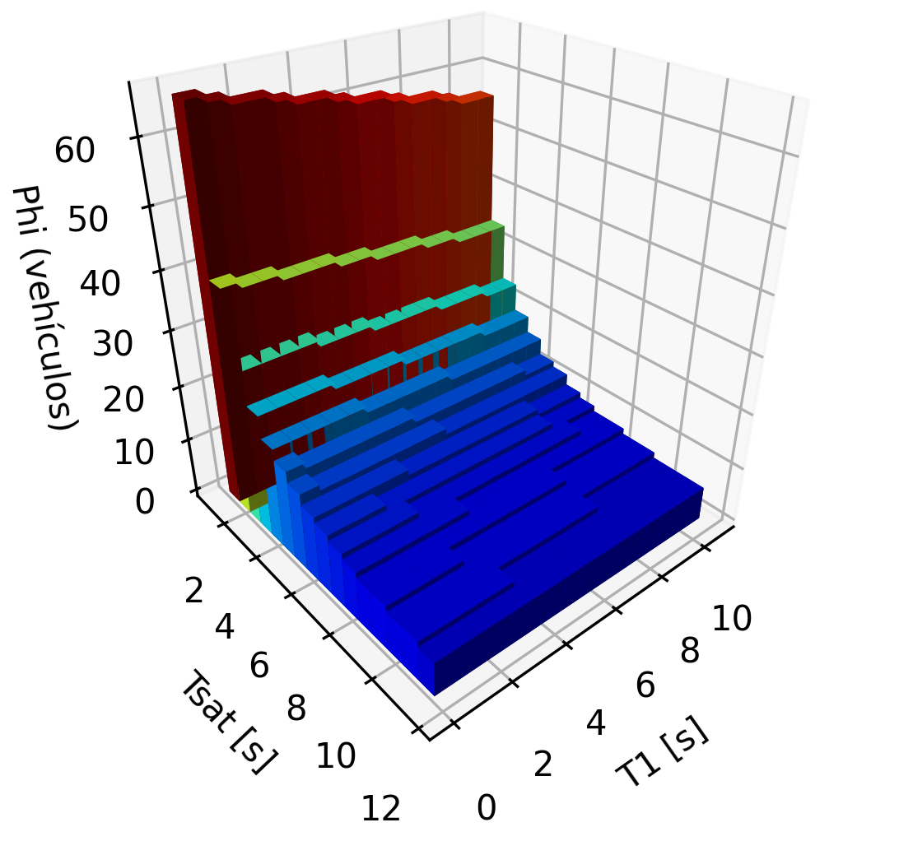
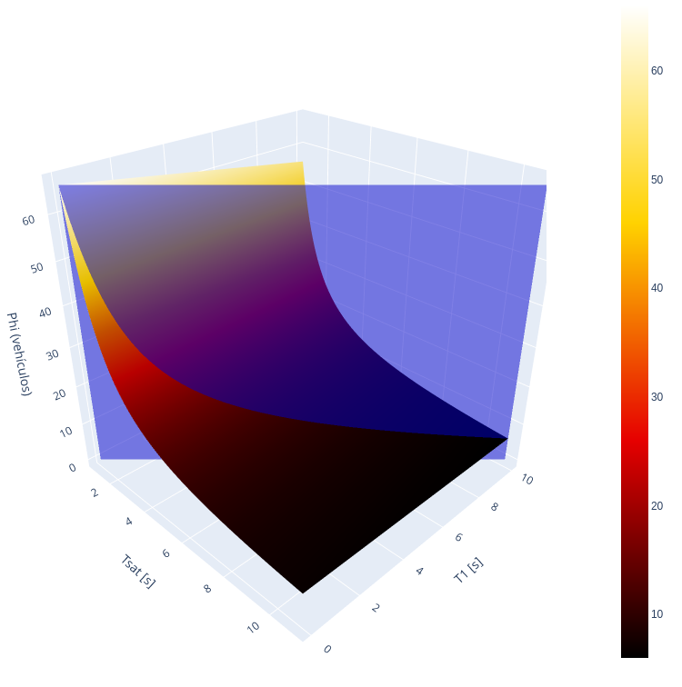
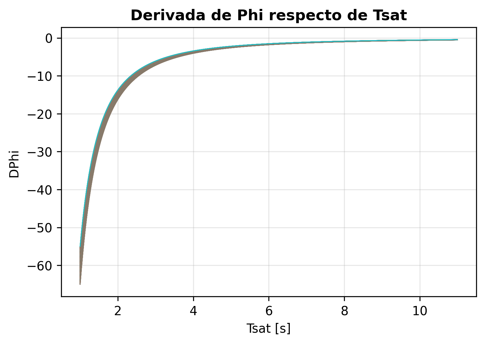
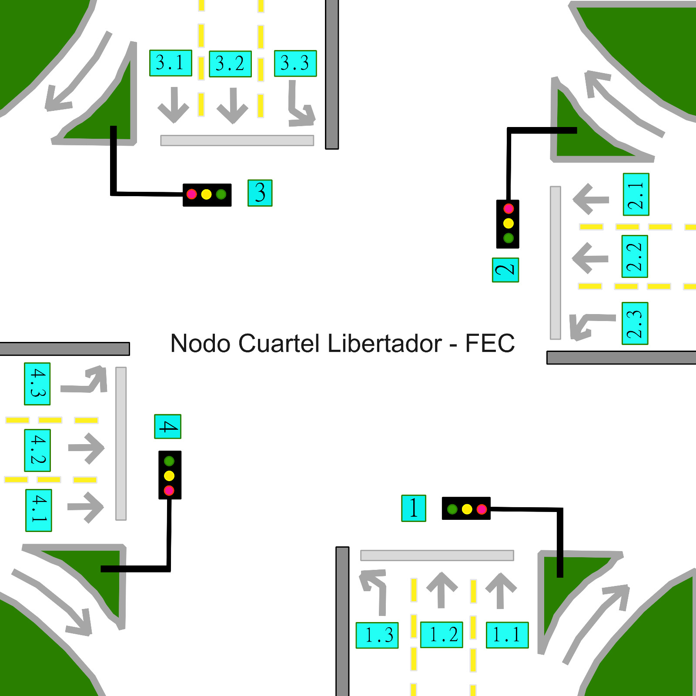
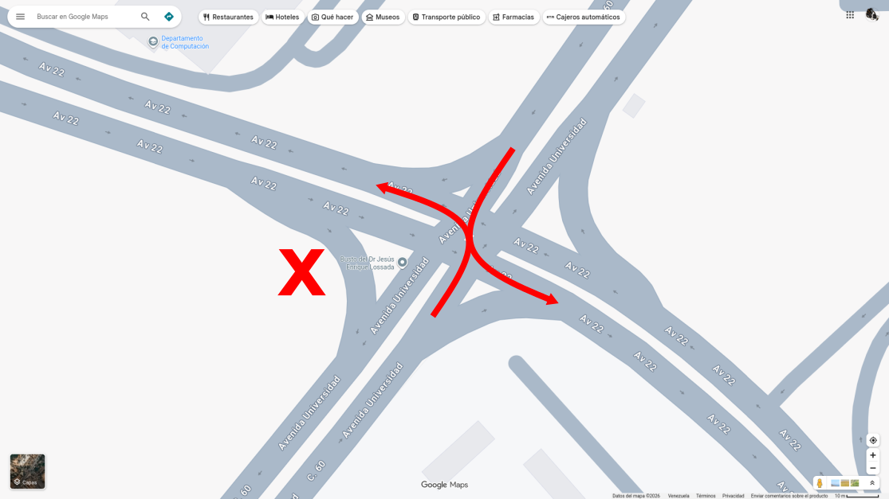

# Modelo de Tráfico Urbano

**Author:** Davalillo D. Carlos M.

---

## Abstract

El transito urbano es representado mediante un modelo discreto de descarga de cola, también conocido como ecuación de descarga de flujo de saturación, que se utiliza en ingeniería de tráfico y análisis de capacidad de intersecciones.

---

## Carácterísticas del modelo asignado

El modelo asignado por el profesor es descrito mediante la ecuación

$$ \Phi = 1 + \left\lfloor \frac{g - T_1}{T_{sat}} \right\rfloor \qquad (1) $$

**Glosario de Términos:**

- **$$\Phi$$ (Flujo):** Número total de vehículos que logran cruzar la línea de pare en un tiempo de verde.
- **$$g$$ (Verde):** Tiempo total de luz verde más luz amarilla asignado al canal (variable de control).
- **$$T_1$$ (Inercia):** Tiempo que tarda el primer vehículo en arrancar y cruzar la linea de pare (Reacción).
- **$$T_{sat}$$ (Saturación):** Tiempo promedio entre los vehículos que vienen detrás del primero.

Con las siguientes indicaciones. Si en el canal 1.1 tenemos un verde de $$g = 30s$$, una inercia de $$T_1 = 4.0s$$ y un tiempo entre vehículos de $$T_{sat} = 2.2s$$:

1. Restamos la inercia del verde: $$30 - 4 = 26s$$ (Tiempo disponible para el resto de la cola).
2. Dividimos entre la saturación: $$26 / 2.2 = 11.81$$.
3. Aplicamos la función piso ($$\lfloor \rfloor$$): $$11$$ vehículos.
4. Sumamos el primer vehículo: $$11 + 1 = 12$$ vehículos.

**Resultado:** $$\Phi = 12$$ vehículos por fase.

---

## Debilidades del modelo planteado

Si bien esta ecuación es una herramienta estándar y fundamental en la ingeniería de tráfico (especialmente en manuales como el Manual de Capacidad de Carreteras), se trata, sin duda, de un modelo muy simplificado. La principal debilidad conceptual es que esta ecuación calcula la descarga potencial máxima (capacidad), no lo que ocurre en realidad.

El modelo hace la suposición de cola infinita, es decir, la ecuación asume que siempre hay una fila de vehículos esperando. Si el semáforo se pone en verde, pero solo hay 3 vehículos esperando, la ecuación podría arrojar $$\Phi = 10$$. Sobreestimará la descarga a menos que se limite manualmente con la longitud real de la cola, por ejemplo mediante $$\Phi_{actual} = min(\Phi, \text{longitud de la cola})$$.

Igualmente se hace la suposición de vía libre "aguas abajo", es decir, asume que la carretera inmediatamente después de la intersección está completamente vacía. Si la siguiente intersección está congestionada (fenómeno conocido como congestión por reflujo), los vehículos no entrarán en la intersección, incluso si el semáforo está en verde. Esta ecuación ignora por completo la congestión aguas abajo.

El modelo posee la falacia del "vehículo homogéneo". La ecuación trata a todos los vehículos como si fueran idénticos. En realidad, un camión con mucha carga tarda mucho más en acelerar desde su estado parado que un sedán pequeño. Asímismo, los autobuses que paran para recoger pasajeros interrumpen el flujo. Para solucionar esto, los ingenieros de tráfico tienen que convertir todos los vehículos a Unidades de Vehículos de Pasajeros (PCU) o aplicar factores de ajuste para vehículos pesados, lo que añade capas de complejidad que la ecuación básica ignora.

El mito del intervalo de tiempo "constante" ($$T_{sat}=\text{constante}$$) es otro factor a tener en cuenta. La ecuación asume que el intervalo de tiempo de saturación $$T_{sat}$$ es un número perfectamente constante (por ejemplo, exactamente 2,0 segundos). En realidad, los intervalos de tiempo son estocásticos (aleatorios), varían en función de los tiempos de reacción de los conductores, las condiciones meteorológicas (la lluvia aumenta el intervalo de tiempo), la pendiente de la carretera (las subidas ralentizan a los vehículos pesados) e incluso la hora del día. Al tratar $$T_{sat}$$ como una constante, el modelo ignora las fluctuaciones naturales y aleatorias del comportamiento de conducción humana.

El modelo también presenta limitaciones matemáticas y computacionales. Así por ejemplo la función piso $$\lfloor \rfloor$$ crea una función escalonada discontinua que no es diferenciable. Si desea utilizar optimización matemática avanzada (como el descenso de gradiente u otros algoritmos) para encontrar el tiempo verde óptimo absoluto ($$|g|$$) que minimice el retraso total en una red urbana, no puede utilizar esta ecuación directamente. Los algoritmos de optimización requieren funciones continuas, suaves y diferenciables. Como solución alternativa a este modelo los ingenieros a menudo tienen que "relajar" el modelo para la optimización eliminando la función piso y usando solo la versión continua: $$\Phi \approx 1 + \frac{g - T_1}{T_{sat}}$$, y luego redondeando solo al final.

Un elemento final a tener en cuenta al emplear dicha ecuación es que se asume una luz verde "perfecta" donde los autos pasan sin problemas, es decir, la ecuación ignora:

- **Peatones:** si los peatones cruzan, los vehículos que giran a la derecha (o a la izquierda, según el país) deben ceder el paso, lo que reduce drásticamente la tasa de descarga.
- **Ancho y geometría del carril:** Un carril estrecho o una curva cerrada ralentizarán $$T_{sat}$$, pero la ecuación base no considera la geometría.
- **Variabilidad de arranque:** se asume que $$T_1$$ es una constante fija. Sin embargo, los estudios demuestran que si la cola es muy larga, el primer conductor podría estar más alerta y reaccionar más rápido que si fuera el único vehículo en un semáforo en rojo.

Dadas todas estas deficiencias, uno podría preguntarse ¿por qué sigue siendo el estándar? La respuesta radica en la eficiencia computacional y la planificación macroscópica. Si se intenta calcular el rendimiento diario de 5000 intersecciones en toda una ciudad, ejecutar una simulación microscópica altamente detallada, segundo a segundo (donde cada automóvil tiene su propio perfil de aceleración y tiempo de reacción aleatorio), requiere una enorme capacidad de procesamiento. Esta ecuación es un modelo macroscópico aproximado. Es computacionalmente instantáneo, matemáticamente simple y, si bien es inexacto a nivel microscópico (segundo a segundo), es sorprendentemente preciso a nivel macroscópico (hora a hora) en promedio.

---

## Cómo graficar el modelo

El modelo matemático tal como es planteado emplea la función piso $$\lfloor \text{ } \rfloor$$ que es una función entera que devuelve el mayor entero que es menor que el valor dado. Esta función se comporta en forma discontinua pero siguiendo la envolvente representada por la función definida sin el uso de la función piso (Ver la figura 1b). Puesto que $$T_{sat}$$ tiende a ser físicamente un valor más grande, el máximo valor de $$\Phi$$ en la práctica se encuentra cerca del valor medio de $$T_{sat}$$ para un valor de $$T_1$$ mayor al valor medio. Este comportamiento quiere indicar que existen variaciones en los datos experimentales que no pueden ser explicados completamente por el modelo matemático planteado. Por tanto se eligen las barras 3D para representar los datos experimentales (considerados discretos) obtenidos. La gráfica de barras es acompañada de una superficie envolvente que describe el comportamiento de los datos (las barras) para un caso en el que se aproxima los valores en términos de una función real continua.

La representación gráfica simple de $$\Phi$$ es sin embargo, de alcance general, su geometría y análisis es aplicable a todos los datos experimentales que pueden expresarse mediante la ecuación (1) que representa este modelo de tráfico vehicular. Considerando el gráfico de barras, se puede notar que para un valor de $$T_1$$ fijo $$\Phi$$ aumenta con la disminución de $$T_{sat}$$ y la discretización natural que aparece al medir estos datos da una panorama del factor por el cual debe disminuirse $$T_{sat}$$ para aumentar $$\Phi$$, y esto representa la justificación más importante para emplear el las barras tridimensionales.

---

## Análisis matemático

La función $$\Phi$$ tiene una constante que no puede ser cambiada y que es considerada como un parámetro fijo, en este caso se trata de $$g$$ que aparece en la ecuación (1) y que representa un valor constante establecido por normas internacionales. Considerando lo anterior la función $$\Phi$$ tiene un valor no nulo para todo el plano de variables $$(T_1,T_{sat})$$ que viene representado por la constante independiente 1, es decir, la función tiene como soporte compacto el plano $$P=\{(x,y) \in (T_1,T_{sat})|x,y>0\}$$. Puesto que la función que describe a $$\Phi$$ contiene la función piso $$\lfloor \text{ } \rfloor$$ es de suponer que la ecuación (1) no es contínua, ya que la función piso puede definirse como[^1]

$$ \lfloor x \rfloor \equiv \lim_{n \to \infty}{\left(x-\frac{1}{2}+\frac{1}{\pi}\arctan{(n\cot{(\pi x)})}\right)} $$

[^1]: Esta es una de las muchas formas de definir la función piso.

Que como el lector puede notar el argumento $$\cot{(\pi x)}$$ tiene discontinuidades en multiplos enteros de $$\pi$$. Así pues el modelo original dado presenta discontinuidades discretas en su dominio. No obstante esta característica limitante, la función original puede estudiarse si se considera que la ecuación

$$ \Phi = 1 + \frac{g - T_1}{T_{sat}} \quad T_1<g \qquad (2)} $$

Describe una envolvente de los valores de la función original. Esto puede hacerse ya que la función piso es una función creciente y el numerador de la fracción que aparece es siempre positivo. Si por alguna razón se viola la condición $$T_1<g$$ el modelo matemático no tiene sentido o simplemente no representa la realidad adecuadamente. Con lo anterior en mente se puede hacer la conclusión de que $$\Phi$$ y $$T_{sat}$$ son inversamente proporcionales y por tanto $$\Phi$$ simplemente será mayor para un menor valor de $$T_{sat}$$ independientemente de $$T_1$$, lo cual ocurre a razón de

$$ \frac{d\Phi}{dT_{sat}} = -\frac{g-T_1}{T_{sat}^2} \quad T_1<g \qquad (3) $$

Es decir $$\Phi$$ disminuye cuadráticamente con el aumento de $$T_{sat}$$ y por tanto $$T_{sat}$$ es la variable que más influencia tiene sobre $$\Phi$$. Vea la figura 1b y observe que el plano que corta la superficie de $$\Phi$$ tiene una curva hiperbólica en su intersección con la superficie $$\Phi(T_1,T_{sat})$$ cuya pendiente respecto de $$T_{sat}$$ es dada por la ecuación (3). Note además que la derivada de $$\Phi$$ respecto de $$T_1$$ es simplemente una constante, que curiosamente también depende de $$T_{sat}$$ en forma inversamente proporcional

$$ \frac{d\Phi}{dT_1} = -\frac{1}{T_{sat}} \qquad (4) $$

Por tanto diminuir el tiempo de saturación $$T_{sat}$$ impacta directa y significativamente a $$\Phi$$ independientemente de los demás parámetros. Además considere que $$g$$ es una constante, mientras que $$T_1$$ aunque variable, oscila alrededor de una media ya que los vehículos que circulan, son en su mayoría similares. Con esto en mente, cabe preguntarse ¿en qué factor debe disminuirse $$T_{sat}$$ para que el flujo de vehículos $$\Phi$$ se multiplique por un factor $$n$$? Para responder esta pregunta observe que si $$T_{sat}$$ se disminuye hasta un valor $$\frac{T_{sat}}{m}$$ con $$m>1$$ entonces

$$ \Phi = 1 + \frac{g - T_1}{\frac{T_{sat}}{m}} \quad T_1\<g $$

$$ \Phi = 1 + m\left(\frac{g - T_1}{T_{sat}}\right) \quad m>1 $$

$$ \Phi = 1 + m\frac{g - T_1}{T_{sat}} $$

Si $$\Phi_1$$ es el flujo antes de disminuir $$T_{sat}$$ y $$\Phi_2$$ es el flujo luego de disminuir $$T_{sat}$$ hasta el valor $$\frac{T_{sat}}{m}$$, con $$m>1$$, entonces $$\Phi_2=n\Phi_1$$ y por tanto

$$ n\Phi_1 = 1 + m\frac{g - T_1}{T_{sat}} $$

De donde

$$ n = \frac{1}{\Phi_1}\left[ 1 + m\frac{g - T_1}{T_{sat}} \right] $$

$$ n = \frac{1 + m\frac{g - T_1}{T_{sat}}}{1 + \frac{g - T_1}{T_{sat}}} $$

$$ n(m) = \frac{T_{sat} + m(g - T_1)}{T_{sat} + g - T_1} \quad T_1<g \quad m>1 \qquad (5) $$

La ecuación (5) indica que si se disminuye $$T_{sat}$$ por un factor de $$\frac{1}{m}$$ se obtiene un incremento en $$\Phi$$ de $$n(m)$$ y por tanto se mejora la circulación de vehículos por un factor de $$n(m)$$ si se mantiene el resto de variables.

## Aplicación al Problema Planteado

Para iniciar este apartado considerar la Figura 3 que se muestra más abajo. En ella se muestra esquemáticamente la intersección entre avenidas del Edificio Grano de Oro y el Cuartel Libertador. Las indicaciones de esta actividad plantean dos escenarios A y B, bajo el modelo planteado por la ecuación 1. En dicha ecuación los términos $$T_1$$ y $$T_{sat}$$ pueden tener experimentalmente en la práctica cualquier valor finito mayor que cero (no existe la velocidad infinita y entonces $$T_1$$ y $$T_{sat}$$ no pueden ser cero), por las debilidades del modelo planteadas anteriormente. Por tanto A y B son indecidibles a priori bajo este modelo matemático pues se puede obtener cualquier combinación de $$T_1$$ y $$T_{sat}$$ que hagan que los escenarios A y B sean iguales, A mejor que B y también B mejor que A. 

Apartando la consideración anterior, las imágenes de satélite (ver Figura 4) muestran que la circulación de la avenida Libertador con la avenida 22 debe mantenerse tal como está, puesto que una modificación de la alternancia en el patrón de cambio de luces del semáforo conduciría a una catástrofe por la disposición de las vías que no permite una circulación simultánea de más de una vía. Solo se permite la circulación de las vías paralelas.

Si se omite la consideración anterior y se hace la suposición de que efectivamente es posible que dicha modificación del patrón de cambio del semáforo es posible, aún así se tendría una imposibilidad matemática de hallar una solución óptima de entre A y B. Esto se debe a que A se expresa como el flujo promedio de la secuencia 1,2,3,4 es decir

$$ \Phi_A = \frac{\Phi_1+\Phi_2+\Phi_3+\Phi_4}{4} $$

Mientras que B es el máximo de entre las secuencias promedio 1,3 y 2,4 

$$ \Phi_B = max(\frac{\Phi_1+\Phi_3}{2},\frac{\Phi_2+\Phi_4}{2}) $$

Pero como $$T_1$$ y $$T_{sat}$$ pueden tener cualquier valor para cada canal 1,2,3,4 entonces realmente $$\Phi_A$$ y $$\Phi_B$$ pueden tener cualquier valor finito positivo mayor que cero, y en consecuencia en base a este modelo matemático no hay forma de determinar matemáticamente si A es mejor que B o viceversa. Sin embargo, si es posible obtener una medida estadística que permita establecer si A es mejor que B o a la inversa, pero ello requiere un gran número de mediciones para establecer valores de tendencia central y de dispersión. Los resultados de realizar las mencionadas medidas estadísticas solo tienen validez localmente, y están sujetas a variaciones si se consideran intervalos de medición amplios en el tiempo (por ejemplo mediciones hechas en diciembre o en agosto, o considerando un año de mediciones o solo unos meses).

Si se considera un mismo valor promedio para los flujos 1,2,3, y 4, entonces es claro que el escenario B es exactamente igual al A, si esta suposición no se considera y se asume que los flujos 1,2,3, y 4 pueden variar, entonces el escenario óptimo dependerá de las mediciones,pero su validez puede cambiar con el tiempo pues la afluencia de vehículos no ocurre a una razón constante para todos los intervalos de tiempo (por ejemplo en solo 12 horas se ve una variación pues no es la misma circulación de vehículos en el día que en la noche, por ejemplo).

---

## Concluciones

La ecuación (1) representa un modelo simple pero efectivo de establecer el tránsito de vehículos. Del análisis matemático de la función que la describe se concluye que esta función no tiene un valor máximo para $$\Phi$$ en tanto que sus derivadas parciales no tienen punto crítico. Solo se puede afirmar que el valor de $$\Phi$$ aumenta cuanto más se disminuya el valor de $$T_{sat}$$ independientemente del resto de parámetros de la ecuación. No obstante, si se introduce una restricción como un valor constate de $$T_1$$, entonces $$\Phi$$ tiene un valor máximo bien definido en esas condiciones suponiendo un valor experimental constante para $$T_{sat}$$ bien definido. El modelo tiene dificultades para representar el tránsito vehicular si existe una gran variación estadística de $$T_{sat}$$, en cuyo caso se requiere un modelo más adecuado que incluya otros parámetros. Cuando el modelo es adecuado, para aumentar el flujo de vehículos por un factor de $$n$$ se debe disminuir $$T_{sat}$$ por un factor de $$m$$ y la relación exacta $$n(m)$$ es la ecuación (5) dada anteriormente.

---

## Figuras

*Figura 1a: Representación de la función $$\Phi$$ para los datos experimentales tomados cuando se emplea la función $$\lfloor \text{ }\rfloor$$ (piso).*

*Figura 1b: Representación de la función $$\Phi$$ para los datos experimentales tomados cuando no se emplea la función $$\lfloor \text{ } \rfloor$$ (piso).*

*Figura 2: Gráfica de la derivada de $$\Phi$$ respecto de $$T_{sat}$$.*

*Figura 3: Esquemático del problema planteado en la intersección FEC-Cuartel Libertador.*

*Figura 4: Mapa mostrando el choque vehicular con el cambio del patrón de funcionamiento del semáforo.*

---
