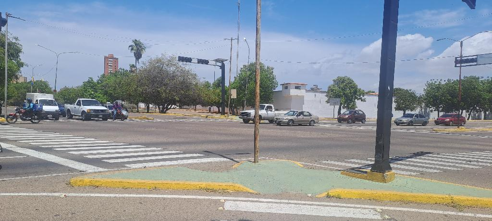
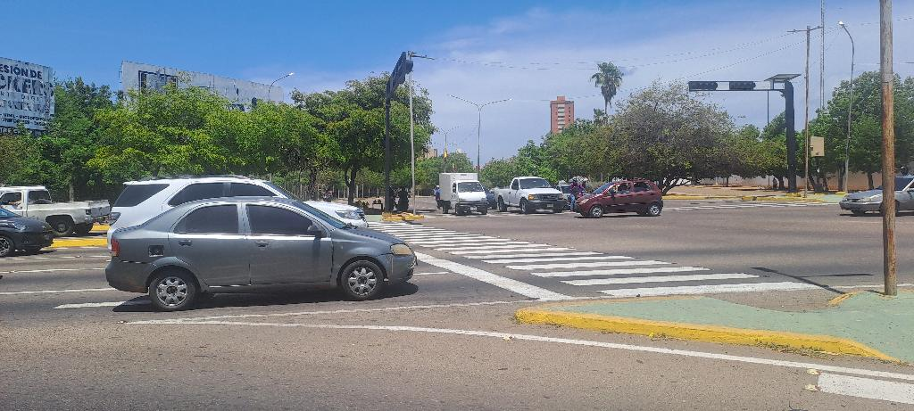

# Modelo de Tráfico Urbano

**Author:** Davalillo D. Carlos M.

---

## Análisis Núcleo FEC

El nodo correspondiente a la esquina Grano de Oro con Cuartel Libertador se ha analizado heurísticamente mediante imágenes de satélite y el resultado es completamente desolador. No pueden modificarse las variables tal como se pensaba en un principio debido a las características físicas de la disposición de las vías involucradas (apartando los señalamientos hechos en el primer informe).

## Imágenes de satélite

Las imágenes de satélite muestran que la circulación de la avenida Libertador con la avenida 22 debe mantenerse tal como está, puesto que una modificación de la alternancia en el patrón de cambio de luces del semáforo conduciría a una catástrofe por la disposición de las vías que no permite una circulación simultánea de más de una vía. Solo se permite la circulación de las vías paralelas.

A pesar de este inconveniente, no se establece ninguna restricción estricta sobre el tiempo de duración de la circulación y la parada de los semáforos (tiempo en verde y tiempo en rojo), lo que puede conducir a mejoras en la gestión del tráfico. Si bien es cierto existe una legislación internacional que establece los tiempos medios para el cambio de estado en los semáforos, también es cierto que dicha legislación no es vinculante y las autoridades locales pueden realizar modificaciones o ajustes adaptados a las condiciones locales. 

En ese sentido, puede establecerse un patrón de gestión del tráfico similar al modelo chino ([Modelo chino](https://isprs-archives.copernicus.org/articles/XLVIII-G-2025/665/2025/isprs-archives-XLVIII-G-2025-665-2025.pdf)) en el que el tiempo en verde es delimitado en parte por la afluencia de vehículos en el resto de vías. Así por ejemplo, cuando una vía no tiene vehículos en circulación, se espera un tiempo prudencial más allá del cual si aún no hay vehículos en circulación entonces se pasa esa vía a rojo y se cambia a verde otras vías con vehículos en espera del cambio en el semáforo. De esta manera se maximiza el tiempo en el que los vehículos se encuentran circulando, con la consecuente disminución global de la congestión vehicular.

*Figura 1: Mapa mostrando el choque vehicular con el cambio del patrón de funcionamiento del semáforo.*

*Figura 2: Evidencia de trabajo de campo.*

*Figura 3: Vehículo previo a la medición de $$T_1$$.*

